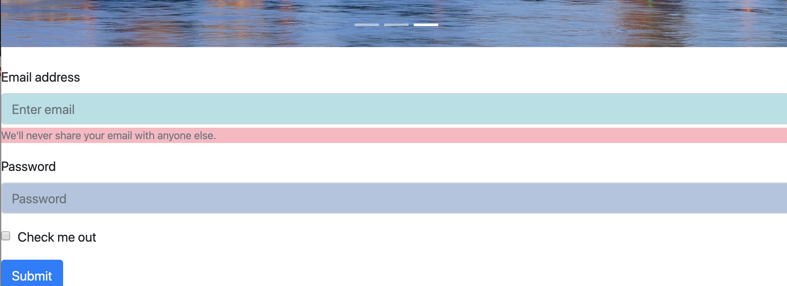

# `What I Learned in Week 12`

### `Componentize`
* There are couple of different websites we can you to make our website pretty if we do not focus on the style. The websites are:
* [Materialize CSS](https://materializecss.com/)
* [Bootstrap](https://getbootstrap.com/)
* [Semantic UI](https://semantic-ui.com/)
* [Bulma](https://bulma.io/)
* These websites offer css style templates for other programmers to use. It is very useful and easy to use. * For my project, I used bootstrap. 
* Directions:
  1. You copy and paste the link to the head section on your html. There is also another link to copy as a script tag to the end of your body section.
  2. Then you copy different components and paste them to your html. I copied many different components such as nav bar and they looked very cool.

* Here is a snapshot of my project with bootstrap:

* 

### `Object orientred Programming`

Const Todo = {
	Name,
	Date,
	Complete,
}
